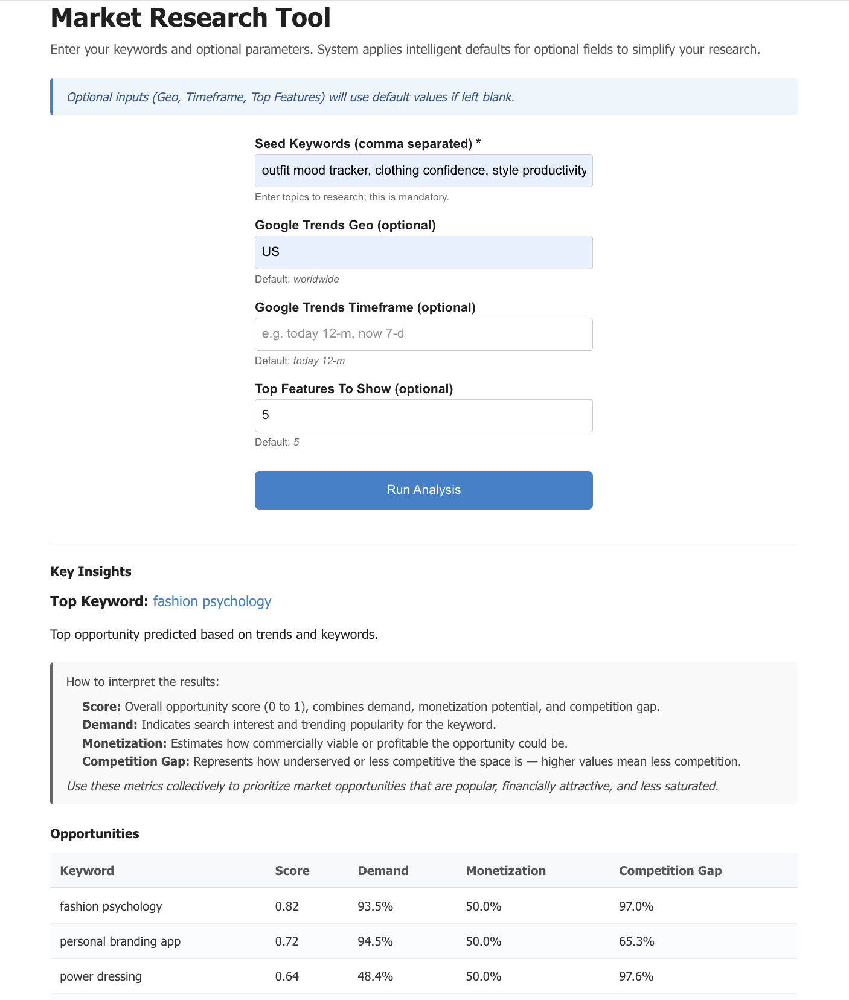

# Market Research SPA — v1.0

## Project Overview

This is a clean, minimal single-page application (SPA) built with **Next.js (App Router + TypeScript)** designed for early-stage digital market research. The app takes a few user inputs, runs backend data aggregation and scoring based on Reddit and Google Trends data, and returns prioritized market opportunities.

The app uses:

- A minimal frontend with an easy input form
- A backend API route handling input sanitization, subreddit auto-discovery, scoring, and error handling
- Simple outputs with text and tables to help you quickly understand market trends

## Folder Structure
```
my-market-research-app/
├── app/
│ ├── api/
│ │ └── analyze/
│ │ └── route.ts # Backend API route handler (POST)
│ └── page.tsx # Frontend main SPA page
├── components/
│ └── InputForm.tsx # React input form component (improved tips)
├── lib/
│ ├── reddit.ts # Reddit API helpers + subreddit discovery + cache
│ ├── googleTrends.ts # Google Trends stub functions
│ ├── huggingface.ts # Hugging Face API helper (stub)
│ ├── scoring.ts # Scoring logic for opportunities
│ └── utils.ts # Input sanitization & helper functions
├── public/ # Static files (images, icons, etc.)
├── .env.local # Environment variables – NOT committed
├── next.config.js # Next.js config (optional)
├── tsconfig.json # TypeScript config
├── package.json # Dependencies and scripts
└── README.md # This documentation file
```

## Inputs and What They Mean

| Input                    | Description                                                              | Default if Left Blank                 |
|--------------------------|--------------------------------------------------------------------------|-------------------------------------|
| **Seed Keywords**         | Comma-separated list of keywords or topics you want to research         | *Required* — cannot be left blank   |
| **Google Trends Geo**     | Region code for Google Trends analysis (e.g., US, GB, IN, worldwide)    | `WORLDWIDE`                         |
| **Google Trends Timeframe** | Time period for analyzing trends (e.g., `today 12-m` = past 12 months) | `today 12-m`                       |
| **Top Features To Show**  | How many top opportunities you want to see in results                   | `5`                                |

## What the System Does Under the Hood

- **Subreddit Auto-discovery:** Searches Reddit for top relevant subreddits based on your seed keywords (top 5 subreddits). Defaults to common subs like `Entrepreneur` and `startups` if none found.
- **Google Trends Data:** Fetches interest data (stubbed currently) for your keywords within selected geo and timeframe.
- **Opportunity Scoring:** Combines trend demand, monetization potential, and competition gap with tuned weights (Demand=0.4, Monetization=0.3, Competition Gap=0.3).
- **Outputs:** Returns a ranked list of opportunities with scored metrics.
- **Error Handling:** Gracefully handles missing or partial data, showing warnings on the frontend if needed.

## UI Behavior

- The input form clarifies what each field means and shows default values applied when left blank.
- Upon submission, the UI shows a loading message.
- When results are returned, a summary with the top keyword and a table ranking all opportunities by score are displayed.
- Warnings (like fallback defaults) appear in a highlighted note box.
- No complicated charts or CSV exports; just clean, readable insights that are easy to interpret.
- A minimal banner informs that optional inputs have system default values applied automatically.

## How to Interpret the Results

- **Score:** Overall opportunity score combining demand, monetization, and competition gap (0 to 1 scale).
- **Demand:** Trending search interest or popularity of the keyword.
- **Monetization:** Estimated commercial potential or profitability.
- **Competition Gap:** How underserved or less competitive the opportunity is (higher means less competition).

Users should prioritize keywords/opportunities with high scores considering all these aspects collectively.

---

## How to Use

1. Enter **seed keywords** separated by commas (this is mandatory).
2. Optionally enter a **Google Trends geographic region** (e.g., `US` for United States). Leave blank for worldwide.
3. Optionally enter a **Google Trends timeframe** (e.g., `today 12-m` for last 12 months). Leave blank for default.
4. Optionally choose how many **top opportunities** to display.
5. Click **Run Analysis**.
6. View insights and opportunity rankings below the form.

## Frontend InputForm Component Overview

The form includes brief hints beneath each input field informing:

- **Seed Keywords:** *Enter topics to research; this is mandatory.*
- **Google Trends Geo:** *Optional, default is 'worldwide'.*
- **Google Trends Timeframe:** *Optional, default is 'today 12-m' (last 12 months).*
- **Top Features To Show:** *Optional, default is 5.*

Warnings or notes appear below the form in a highlighted box if fallback defaults are used during processing.

---

## License & Contributor Notes

This project is open for extension and improvement. Contributions welcome. Keep environment variables with API tokens secret and out of the codebase.

---




This is a [Next.js](https://nextjs.org) project bootstrapped with [`create-next-app`](https://nextjs.org/docs/app/api-reference/cli/create-next-app).

## Getting Started

First, run the development server:

```bash
npm run dev
# or
yarn dev
# or
pnpm dev
# or
bun dev
```

Open [http://localhost:3000](http://localhost:3000) with your browser to see the result.

You can start editing the page by modifying `app/page.tsx`. The page auto-updates as you edit the file.

This project uses [`next/font`](https://nextjs.org/docs/app/building-your-application/optimizing/fonts) to automatically optimize and load [Geist](https://vercel.com/font), a new font family for Vercel.

## Learn More

To learn more about Next.js, take a look at the following resources:

- [Next.js Documentation](https://nextjs.org/docs) - learn about Next.js features and API.
- [Learn Next.js](https://nextjs.org/learn) - an interactive Next.js tutorial.

You can check out [the Next.js GitHub repository](https://github.com/vercel/next.js) - your feedback and contributions are welcome!

## Deploy on Vercel

The easiest way to deploy your Next.js app is to use the [Vercel Platform](https://vercel.com/new?utm_medium=default-template&filter=next.js&utm_source=create-next-app&utm_campaign=create-next-app-readme) from the creators of Next.js.

Check out our [Next.js deployment documentation](https://nextjs.org/docs/app/building-your-application/deploying) for more details.


